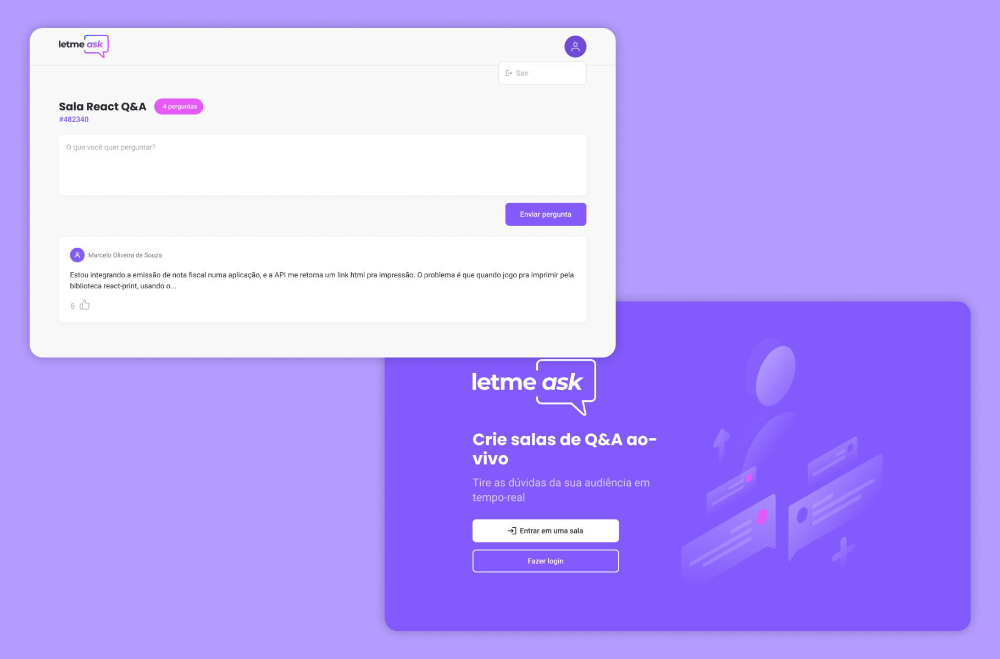

<p align="center">
  
</p>

<p align="center">
   

  

  

     
</p>

<h1 align="center">
    
</h1>

## Projeto

Letmeask é perfeito para criadores de conteúdos e professores poderem criar salas de perguntas e respostas, de uma forma muito organizada e democrática. 

O código base deste projeto foi desenvolvido pela **[Rocketseat](https://www.rocketseat.com.br/)**, nos dias 20 a 27 de Junho de 2021. Mas agora ele conta com algumas integrações atualizadas como [React Router - Version 6](https://reactrouter.com/docs/en/v6/getting-started/overview) e [Firebase SDK Web – Version 9](https://firebase.google.com/docs/web/modular-upgrade).

## Funcionalidades
- **Padrão**
  - [x] Criar uma conta
  - [ ] Deletar sua conta

<br />

- **Administrador**
  - [x] Criar uma sala
  - [x] Encerrar uma sala
  - [x] Ver perguntas feitas em real-time
  - [x] Marcar pergunta como respondida
  - [x] Destacar pergunta
  - [x] Deletar pergunta
  - [ ] Responder pergunta

<br />

- **Usuário**
  - [x] Entrar em uma sala
  - [x] Ver todas perguntas em real-time
  - [x] Enviar uma pergunta
  - [x] Dar like em outra pergunta
  - [ ] Editar pergunta feita
  - [ ] Deletar pergunta feita
  - [ ] Ver respostas

## Tecnologias

Esse projeto foi desenvolvido com as seguintes tecnologias:

- [React](https://reactjs.org)
- [Firebase](https://firebase.google.com/)
- [TypeScript](https://www.typescriptlang.org/)
- [Classnames](https://github.com/JedWatson/classnames)
- [Sass](https://github.com/sass/dart-sass)

## Como executar
Para garantir o devido funcionamento do projeto, certifique-se de ter uma conta no [Firebase](https://firebase.google.com/). Depois siga as configurações a seguir:

1. Crie um projeto com nome Letmeask, ative autenticação com Google e crie um Realtime Database.

2. Adicione essas regras no seu Realtime Database:
```json
{
  "rules": {
    "rooms": {
      ".read": false,
      ".write": "auth != null",
      "$roomId": {
        ".read": true,
        ".write": "auth != null && (!data.exists() || data.child('authorId').val() == auth.id)",
        "questions": {
          ".read": true,
          ".write": "auth != null && (!data.exists() || data.parent().child('authorId').val() == auth.id)",
          "likes": {
            ".read": true,
            ".write": "auth != null && (!data.exists() || data.child('authorId').val() == auth.id)",  
          }
        }
      }
    }
  }
}
```

3. Clone este projeto: 
```bash 
$ git clone https://github.com/lhmoreno/letmeask
```

4. Acesse a pasta e instale as depedências:
```bash
# Acesse a pasta
$ cd letmeask

# Instalar as dependências
$ yarn
```

5. No firebase, crie um app Web. Após isso crie um arquivo ```.env.local``` dentro da pasta raíz do projeto e preencha os dados com as informações fornecidas pelo firebase:

```
# Firebase
REACT_APP_API_KEY=""
REACT_APP_AUTH_DOMAIN=""
REACT_APP_DATABASE_URL=""
REACT_APP_PROJECT_ID=""
REACT_APP_STORAGE_BUCKET=""
REACT_APP_MESSAGING_SENDER_ID=""
REACT_APP_APP_ID=""
```

6. Agora basta rodar o projeto com:
```bash
$ yarn start
```

O app estará disponível no seu browser pelo endereço http://localhost:3000

## Licença

Esse projeto está sob a licença MIT. Veja o arquivo [license](license) para mais detalhes.
